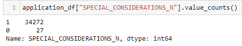

# Analysis report

### Overview of the analysis:

The nonprofit foundation Alphabet Soup wants a tool that can help it select the applicants for funding with the best chance of success in their ventures. The purpose of the model is to use a neural network to create a binary classifier that can predict whether applicants will be successful if funded by Alphabet Soup. The model will be based on the features and results of over 34,000 organizations that Alphabet Soup has previously funded.

### Data Preprocessing:

IS_SUCCESSFUL is the target variable for the model. 0 means that the funding was not used successfully. 1 means the funding was used successfully.

The features of the model are the following:

- APPLICATION_TYPE—Alphabet Soup application type
- FFILIATION—Affiliated sector of industry
- CLASSIFICATION—Government organization classification
- USE_CASE—Use case for funding
- ORGANIZATION—Organization type
- STATUS—Active status
- INCOME_AMT—Income classification
- SPECIAL_CONSIDERATIONS—Special considerations for application
- ASK_AMT—Funding amount requested

The variables EIN and NAME are identification columns that are neither targets nor features and will be removed from the dataset prior to modeling.

### Compiling, Training, and Evaluating the Model:

The intial model had only three layers. It had 80 neurons in the first layer, 30 neurons in the second layer, and 1 in the output layer. It used 100 epochs. It used the sigmoid activation function in the output layer and the relu function in all other layers. This model had only 73.07% accuracy.

The goal for the model performance was 75% accuracy.

In the attempts to increase model performance, the following steps were performed:
- Added more neurons to the first layer and the hidden layers.
- Added more hidden layers.
- Increase the number of epochs to the training regimen.
- Change numeric data types to binary.
- Removing data hypothesized to be inconsequential.

The first optimization attempt increased the number of layers to 8, increased the initial number of neurons in the first layer to 129 (three times the number of features), and increased the number of epochs to 150. This model had an accuracy of 72.9%.

Since adding more complexity to the model resulted in a worse accuracy score, the second optimization attempt took the initial model and just changed one of the features. Rather than send the model on each unique ASK_AMT, that column was eliminated and instead was changed to just two binary values for if the ASK_AMT was equal to $5000 or over $5000. This was chosen because $5000 was the minimum ASK_AMT and also the most common ASK_AMT by far. The resulting accuracy score was 72.48%.

For the third optimization attempt, we stuck with the same model from the initial attempt but eliminated the SPECIAL_CONSIDERATIONS columns, since upon review it seems like special considerations are rare.

The third optimization attempt resulted in an accuracy score of 73.71%. This is the best model attempted as it was the only one that improved upon the initial model.

### Summary: 

Despite these three optimization attempts, the target accuracy of 75% was not achieved.

In addition to a neural network, this type of binary classification could be done by another supervised learning method, such as logistic regression or random forest. Perhaps one of these methods would achieve the target accuracy of 75%.